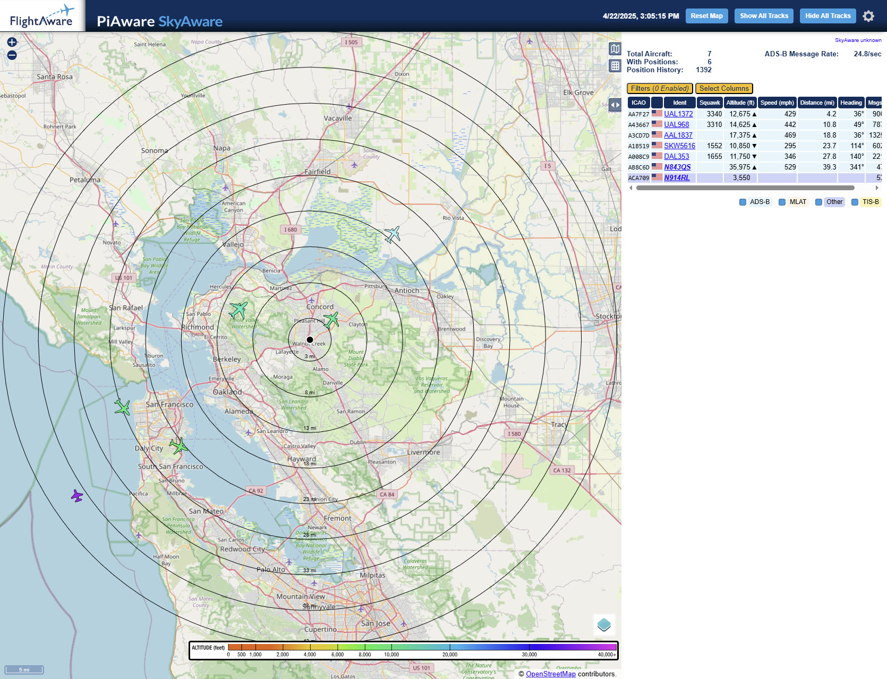

# Real-Time Aircraft Monitoring and Alert System

SkyWatch is a Python-based, real-time aircraft monitoring tool designed to ingest live ADS-B broadcasts in SBS format from a local `dump1090-fa` instance. It processes, enriches, and stores aviation data for analysis and alerting.

Key Features

- **Real-Time Data Ingestion**: Listens to aircraft transponder messages via port 30003 and decodes them into structured flight data.

- **Data Enrichment**: Augments received SBS messages using third-party APIs to retrieve detailed aircraft specifications, operator information, flight routing, and aircraft images.

- **Caching with Redis**: Frequently accessed data is cached in a local Redis instance to reduce redundant external API calls and improve performance.

- **Persistent Storage**: All enriched aircraft data is stored in a PostgreSQL database for long-term analysis and historical referencing.

- **Proximity-Based Alerts**: Sends real-time notifications (via Discord) when an aircraft enters a predefined radius around your location/house.

- **GNSS Integration**: Leverages a connected GNSS module via `gpsd` to obtain precise geographic coordinates for alert accuracy. For more details, refer to the [NTP Server Project](https://github.com/ManiAm/raspi-ntp-server) which shares the same GNSS timing infrastructure.

For more background on how ADS-B works and the data used by this project, see [Background Information](./BACKGROUND.md).

## Wiring and Device Detection

The hardware configuration of skyWatch project is like the following:


The signal flow is:

```text
[Antenna]
   ↓
[Uputronics Preamp + Filter (amplifies and cleans signal)]
   ↓
[FlightAware ADS-B / Mode S Filter (adds more filtering)]
   ↓
[FlightAware Pro Stick Plus (receives and digitizes signal)]
   ↓
[Raspberry Pi (decodes with dump1090 and feeds to FlightAware or others)]
```

- 1090 MHz Antenna

    The antenna is the starting point of the ADS-B receiver setup. It captures radio signals broadcast by aircraft on the 1090 MHz frequency, which include position, altitude, velocity, and identification data. The quality and placement of the antenna are critical — placing it near a window or outdoors with a clear view of the sky significantly improves reception. A high-gain, tuned antenna ensures that weak and distant signals can be picked up effectively.

- Uputronics Preamp + Filter

    Immediately after the antenna, the signal passes through the Uputronics ADS-B filtered preamp. This device has two roles: it applies a band-pass filter to remove out-of-band noise and interference, and it amplifies the 1090 MHz signal using a low-noise amplifier (LNA). By boosting the signal close to its source, the preamp helps preserve signal integrity before it travels down any coaxial cable, which might otherwise introduce attenuation. This stage is especially important when using longer antenna cables or in areas with lots of RF noise.

- FlightAware ADS-B / Mode S Filter

    The signal then enters the FlightAware ADS-B/Mode S Filter, a second band-pass filter specifically designed to pass only signals around 1090 MHz. While the Uputronics preamp already provides filtering, this additional layer helps to further clean the signal by rejecting residual RF noise from sources like mobile towers and Wi-Fi. The cleaner the input to the SDR, the better the decoding accuracy, especially when multiple aircraft are transmitting simultaneously.

- FlightAware Pro Stick Plus

    Next, the filtered and amplified signal is received by the FlightAware Pro Stick Plus. This USB dongle contains an RTL2832U chipset and an R820T tuner, allowing it to function as a SDR. It includes its own built-in band-pass filter and RF amplifier. The dongle digitizes the RF signals into raw I/Q data and passes it over USB to the Raspberry Pi, where it can be decoded.

- Raspberry Pi

    Finally, the digitized signal reaches the Raspberry Pi, where it is processed by dump1090.

    ```text
    [dump1090] ──> [Feeder (PiAware, FR24 Feeder, RBFeeder)] ──> Network
                    │
                    └──> [Web UI like SkyAware or Virtual Radar Server (VRS)]
    ```

    dump1090 decodes the ADS-B messages and can display aircraft positions on a real-time map using the SkyAware web interface. Additionally, the Pi can run feeder clients like PiAware, FR24 Feeder, or RBFeeder to send this decoded data to global flight tracking networks. This stage is the brain of the operation — decoding, visualizing, and sharing live aircraft data.

To check if the FlightAware Pro Stick Plus is properly connected and recognized by Raspberry Pi:

```bash
lsusb

Bus 001 Device 001: ID 1d6b:0002 Linux Foundation 2.0 root hub
Bus 001 Device 002: ID 2109:3431 VIA Labs, Inc. Hub
Bus 001 Device 003: ID 0bda:2832 Realtek Semiconductor Corp. RTL2832U DVB-T  <------
Bus 002 Device 001: ID 1d6b:0003 Linux Foundation 3.0 root hub
Bus 003 Device 001: ID 1d6b:0002 Linux Foundation 2.0 root hub
```

The FlightAware Pro Stick Plus uses a Realtek RTL2832U chipset, which will show up here.

Install the RTL-SDR tools (if not already installed):

```bash
sudo apt update
sudo apt install rtl-sdr
```

Then run:

```bash
rtl_test -t

Found 1 device(s):
  0:  Realtek, RTL2832U, SN: 00001000

Using device 0: Generic RTL2832U
Detached kernel driver
Found Rafael Micro R820T tuner
Supported gain values (29): 0.0 0.9 1.4 ...
[R82XX] PLL not locked!
Sampling at 2048000 S/s.
No E4000 tuner found, aborting.
Reattached kernel driver
```

This confirms that the SDR dongle is initialized and operational.

## Project Structure

Project structure looks like the following:

    raspi-skywatch/
    ├── Dockerfile.dump1090
    ├── Dockerfile.piaware
    ├── docker-compose.yml
    ├── entrypoint.sh
    ├── piaware.conf
    ├── requirements.txt
    └── skywatch/
        ├── db/
        |   ├── FAA-201810.csv
        |   ├── ICAO-doc8643-2019.csv
        │   ├── aircraft_types.json
        │   ├── airlines.json
        │   ├── airplanes.json
        │   ├── airports.json
        │   ├── cities.json
        │   └── countries.json
        ├── skywatch.py
        ├── models_redis.py
        ├── models_sql.py
        ├── rest_client.py
        ├── get_aircraft_svg.py
        ├── utility.py
        └── .env   ---> Your Private API token

## Getting Started

Go to the project root directory:

```bash
cd raspi-skywatch
```

Build the Docker images for dump1090 and piaware:

```bash
docker build -t dump1090-image -f Dockerfile.dump1090 .
docker build -t piaware-image -f Dockerfile.piaware .
```

Open the docker-compose.yml file and make sure to update `LAT` and `LON` variables. These represent your receiver's physical location in decimal degrees. To Find Your Own Latitude and Longitude, open [google maps](https://maps.google.com). Right-click on your house/location to view the coordinates.

Start the containers by:

```bash
docker compose up -d
```

### dump1090-fa Container

Check the `dump1090-fa` container logs to make sure everything is working as expected:

```bash
docker logs dump1090-fa

Mon Apr 21 22:48:58 2025 UTC  dump1090-fa unknown starting up.
2025-04-21 22:48:58: (server.c.1464) server started (lighttpd/1.4.53)
rtlsdr: using device #0: Generic RTL2832U (Realtek, RTL2832U, SN 00001000)
Detached kernel driver
Found Rafael Micro R820T tuner
rtlsdr: tuner gain set to 49.6 dB (gain step 28)
Allocating 4 zero-copy buffers
```

dump1090 creates a set of JSON files in `/run/dump1090-fa/`:

| File              | Purpose                                                                             |
|-------------------|-------------------------------------------------------------------------------------|
| `aircraft.json`   | Live data for currently tracked aircraft (position, altitude, speed, etc.)          |
| `receiver.json`   | Information about the receiver (uptime, version, timestamp)                         |
| `stats.json`      | Receiver statistics and message processing metrics                                  |
| `history_*.json`  | Rolling 10-minute history used for aircraft trails and motion smoothing on the map  |

### SkyAware UI

The SkyAware UI is a real-time, browser-based interface included with FlightAware's dump1090-fa software that visually displays aircraft being tracked by your ADS-B receiver. It shows aircraft positions on a map along with key details such as altitude, speed, callsign, and heading. You can access it by going to:

    http://pihole.home:8080/dump1090-fa/

The interface also includes dynamic range rings. A range ring is a visual overlay displayed on the SkyAware map that shows concentric circles centered around your ADS-B receiver's location, representing fixed distances (e.g., 50, 100, 150 kilometers or miles). These rings help you quickly gauge how far away aircraft are from your station and assess your reception range in all directions. Range rings are especially useful for identifying coverage gaps, visualizing signal strength zones, and understanding the effective reach of your antenna setup.



SkyAware’s flight history relies on a series of JSON files (`history_*.json`) that are generated by dump1090-fa in the `/run/dump1090-fa/` directory. Each file contains a snapshot of aircraft detected during a short interval (typically every 5 seconds), including metadata such as ICAO hex code, position, altitude, speed, and signal strength. The SkyAware UI continuously reads these files to animate recent aircraft movements on the map, giving users a visual sense of flight paths over the past several minutes. Once the history buffer reaches its limit (usually 120 entries), the oldest files are overwritten in a circular fashion. This history is stored in memory-backed temporary storage, meaning it is not persistent and is lost when the system or service is restarted.

### tar1090 UI

tar1090 is an enhanced web-based interface for visualizing real-time and historical ADS-B aircraft data collected by receivers like dump1090-fa. You can access it by going to:

    http://pihole.home:8078/

Designed for enthusiasts and advanced users, it provides a dynamic map showing aircraft positions, persistent flight tracks, signal coverage plots, heatmaps, and performance graphs — all rendered in the browser. Unlike the default SkyAware UI, tar1090 adds powerful features like time-lapse playback, distance-based filtering, and range history, making it a popular choice for building fully-featured local radar stations.

| Feature                           | SkyAware UI         | tar1090 (Enhanced UI)                                      |
|-----------------------------------|---------------------|------------------------------------------------------------|
| Live aircraft map                 | Yes                 | Yes                                                        |
| Persistent flight history         | `No`                | Yes (stored on disk, viewable over time)                   |
| Range plot visualization          | `No`                | Yes (plots max range per direction)                        |
| Heatmap of received signals       | `No`                | Yes (visualizes where you receive the most traffic)        |
| Graphs (messages per second, CPU) | `No`                | Yes (if integrated with graphs1090)                        |
| Timelapse replay                  | `No`                | Yes (view previous flights over time)                      |
| Modular and customizable UI       | Limited             | Highly configurable (ring spacing, colors, filters, etc.)  |
| Data sources supported            | dump1090-fa only    | Any dump1090-based receiver (readsb, dump1090-fa, etc.)    |

### PiAware Container

PiAware is the uploader client that connects to your local dump1090-fa and forwards aircraft data to FlightAware’s servers, and also enables MLAT participation and statistics on your FA profile.

```bash
docker logs -f piaware
****************************************************
piaware version 10.0.1 is running, process ID 1
your system info is: Linux piaware 6.8.0-1020-raspi
Connecting to FlightAware adept server at piaware.flightaware.com/1200
Connection with adept server at piaware.flightaware.com/1200 established
TLS handshake with adept server at piaware.flightaware.com/1200 completed
FlightAware server certificate validated
encrypted session established with FlightAware
Starting faup1090: /usr/lib/piaware/helpers/faup1090 --net-bo-ipaddr dump1090-fa --net-bo-port 30005 --stdout
Started faup1090 (pid 22) to connect to the ADS-B data program at dump1090-fa/30005
UAT support disabled by local configuration setting: uat-receiver-type
logged in to FlightAware as user guest
my feeder ID is xxxx
piaware received a message from the ADS-B data program at dump1090-fa/30005!
piaware has successfully sent several msgs to FlightAware!
18 msgs recv'd from the ADS-B data program at dump1090-fa/30005; 18 msgs sent to FlightAware
```

Piaware establishes a secure (TLS) connection with the FlightAware adept server on port 1200. This is the outbound connection that pushes your ADS-B data to FlightAware. It then spawns a helper called `faup1090` which connects to the Beast-format binary output on port 30005 at host `dump1090-fa`. You are authenticated, and FlightAware assigns your system a unique feeder ID. This is how your aircraft data is tracked and credited on their platform. Claiming your feeder is the next and final step to fully link your local setup to your FlightAware account. Visit this link:

    https://flightaware.com/adsb/piaware/claim/<YOUR-FEEDER-ID>

When you claim your feeder, FlightAware tells your piaware instance to reconnect and log in as you (instead of the default "guest" user). It is also going to link to your account and assign a site number.

Hosting a FlightAware ADS-B receiver (FlightFeeder) provides benefits to both the individual and the broader FlightAware community. As a feeder, you receive a complimentary FlightAware Enterprise Account with access to advanced features, statistics, and free equipment. The community benefits from increased data coverage and the opportunity to explore more aircraft tracks, including those assisted by MLAT. FlightAware Enterprise accounts provide access to FlightAware AeroAPI (formerly FlightXML), which is their official REST API platform for programmatic access to live and historical flight data.

## Running SkyWatch

Set up a Python virtual environment and install the required dependencies listed in requirements.txt:

```bash
python3 -m venv venv
source venv/bin/activate
pip install -r requirements.txt
```


